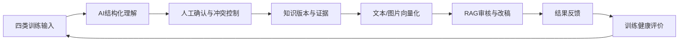
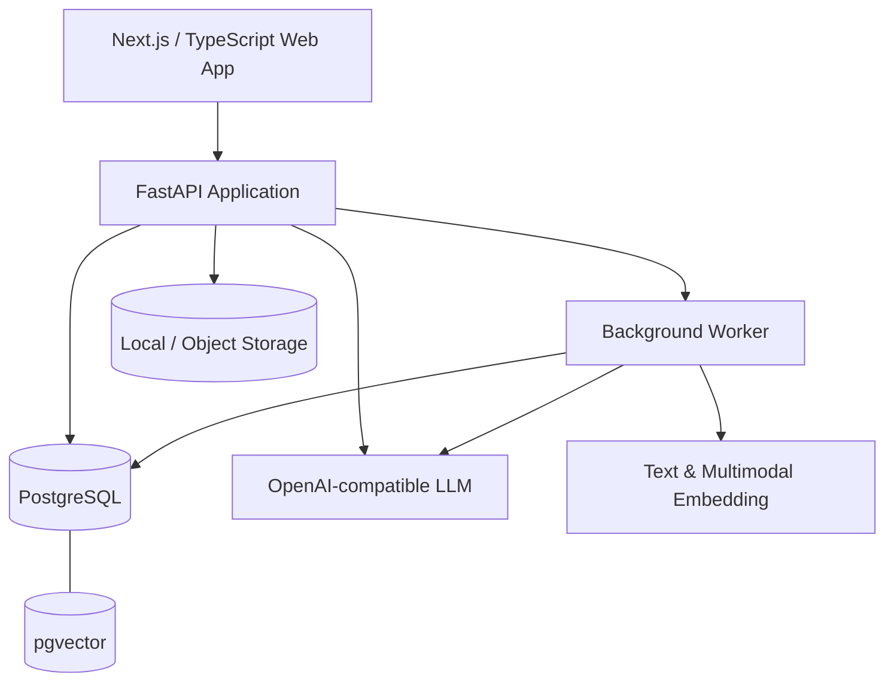

# 知微 · 小红书内容运营大脑

[English](README_EN.md) · [开发路线](ABSORPTION_HEALTH_ROADMAP.md) · [安全迁移说明](安全迁移说明.md)

> 一个面向个人小红书运营的可学习内容系统：把好文章、坏文章、修改前后稿和口述经验转化为可追溯知识，并主动告诉用户下一步应该怎样训练系统。


## 项目解决什么问题

小红书运营审核达人稿时，真正有价值的判断通常存在于个人经验里：什么像硬广、什么符合品牌调性、为什么一句话需要重写、竞品内容哪些方法值得借鉴。这些经验难以结构化，也不会因为简单上传文章就自动变成模型能力。

知微把这一过程拆成完整闭环：



它不是微调模型，而是一个带质量控制、版本管理和反馈回路的个人RAG运营大脑。

## 两个核心特色

### 1. 真正“可以学习”的动态知识库

系统支持四种低操作成本的训练方式：

| 输入方式 | 系统学习的内容 | 学习价值系数 |
|---|---|---:|
| 好文章 | 值得复用的表达、结构和种草方法 | 1.00 |
| 不好的文章 | 问题模式、风险边界和避免方式 | 1.10 |
| 修改前后稿 | 从原稿到终稿的具体修改动作与原因 | 1.50 |
| 口述经验 | 隐性规则、适用条件和运营判断 | 1.25 |

核心机制：

- AI自动拆解标题、开头、结构、调性、卖点、风险、适用范围和可复用规则。
- 原始文章、修改版本、证据、候选知识、正式知识、文本分块和向量分层保存。
- 候选知识必须经过确认；冲突知识不能由AI静默覆盖。
- PostgreSQL中文检索、pgvector语义检索和RRF融合排序共同支持RAG。
- 文章、知识、分块和向量建立可追溯关系，可按文章回退派生知识。
- 相同文章和相同后台任务自动去重；向量任务支持排队、失败重试和真实写入状态。
- 图片保存、视觉理解、OCR线索、可复用视觉规则和多模态向量进入同一知识链路。
- AI审核支持知识库/无知识库双链路对比，直观看到个人知识是否产生价值。

### 2. 主动指导用户的训练健康系统

大多数RAG产品只显示“已上传多少条”，但数量不等于学习质量。知微建立了可解释的吸收质量健康评价：

| 第一阶段维度 | 权重 | 评价内容 |
|---|---:|---|
| 素材质量 | 30% | 内容完整度、反馈具体度、证据、适用边界、规则可执行性和置信度 |
| 训练结构 | 35% | 四类训练信号的有效贡献是否平衡 |
| 内容覆盖 | 20% | 运营类型多样性和单一类型集中度 |
| 知识纯净 | 15% | 分析失败、重复知识和低置信知识是否受控 |

评分不是按篇数线性增长：同类素材超过5、10、20条后贡献逐级递减，防止用户反复导入同质文章刷高分。界面按红、橙、黄、绿展示健康等级，并把复杂诊断翻译成一条明确行动，例如：

> **现在应该做：导入3—5组真实修改前后稿。**

健康度按公式版本和小时保存快照，为后续趋势分析、知识质量和真实审核效果评估保留基础。

## 端到端能力

- 个人账号、独立工作空间和跨空间数据隔离
- 小红书URL解析、正文/作者/话题/互动数据和图片摄入
- 前台人工确认与后台连续自动吸收两种模式
- 十二类内容运营主标签与可见标签
- 文本与图片理解、分块、Embedding和向量队列
- 文章库、小红书式详情弹窗、互动数据和吸收状态
- 文章级知识遗忘与同步向量回退
- AI审核、90分通过线、问题证据、完整改稿和知识引用
- RAG/无RAG审核对比实验
- API Key加密保存、永不向前端回显
- 吸收健康度、动态建议和训练进度可视化

## 系统架构



## 技术栈

- 后端：Python 3.12、FastAPI、Pydantic、psycopg
- 数据层：PostgreSQL、pgvector、JSONB、HNSW、追加式版本管理
- 前端：Next.js、React、TypeScript、Vinext/Vite
- AI：OpenAI兼容Chat Completion、文本Embedding、视觉理解、多模态Embedding
- 安全：加密密钥存储、认证会话、工作空间授权、提示注入隔离
- 测试：pytest、前端生产构建和渲染测试

## 快速开始

### 1. 准备环境

- Python 3.12+
- Node.js 22.13+
- PostgreSQL 17/18 + pgvector

### 2. 配置

```powershell
Copy-Item .env.example .env
```

在 `.env` 中填写你自己的数据库、LLM和Embedding配置。仓库不包含任何真实API Key。

### 3. 安装并启动后端

```powershell
python -m venv .venv
.venv\Scripts\Activate.ps1
pip install -e ".[dev]"
uvicorn app.main:app --reload --port 8000
```

另开终端启动后台任务：

```powershell
python -m app.worker
```

### 4. 启动前端

```powershell
cd frontend
pnpm install
pnpm dev
```

访问 `http://127.0.0.1:3000`，API文档位于 `http://127.0.0.1:8000/docs`。

### 5. 运行测试

```powershell
python -m pytest -q
cd frontend
pnpm build
```

## 当前阶段与路线图

当前已完成吸收质量健康评价第一阶段：材料质量、训练结构、内容覆盖和知识纯净度。后续阶段已经定义但尚未宣称完成：

1. 第二阶段——知识健康：语义去重、证据追溯、适用边界、规则可执行性、冲突中心和质量隔离。
2. 第三阶段——效果健康：检索追踪、固定盲测集、RAG A/B胜率、用户采纳和真实审核质量归因。

完整定义和验收标准见 [ABSORPTION_HEALTH_ROADMAP.md](ABSORPTION_HEALTH_ROADMAP.md)。

## 数据与安全

本公开展示副本不包含：真实 `.env`、API Key、本地加密密钥、用户文章、图片、账号、数据库记录和向量数据。所有外部服务配置都使用占位模板。

## 项目状态

这是一个正在迭代的个人产品工程项目，重点展示：AI产品设计、RAG知识工程、数据建模、异步任务、可解释质量体系、全栈实现和安全意识。它不是小红书官方产品，也不绕过平台登录、验证码或访问控制。

