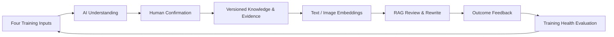
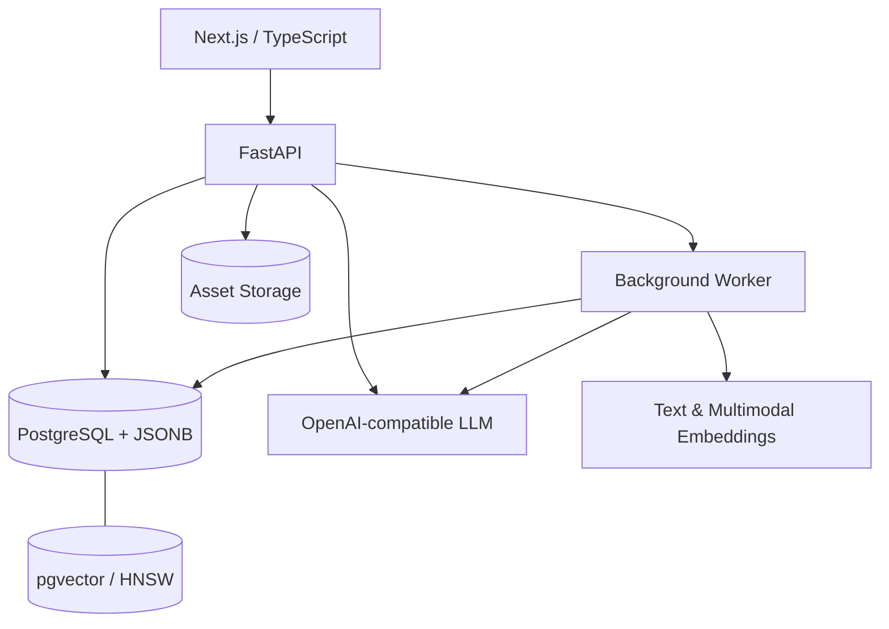

# Zhiwei · A Learning Content Operations Brain for Xiaohongshu

[中文](README.md) · [Roadmap](ABSORPTION_HEALTH_ROADMAP.md) · [Security & Migration](安全迁移说明.md)

> A personal AI system for Xiaohongshu content operators that turns examples, revisions, and tacit expertise into traceable knowledge—and tells the user what to teach it next.

## The Problem

The most valuable review criteria in content operations rarely live in a formal handbook. They live in an operator's judgment: what feels overly promotional, what matches a brand voice, why a sentence should be rewritten, and which competitor patterns are worth learning.

Simply uploading more articles does not make an AI system better. Zhiwei implements a controlled learning loop:



This is not model fine-tuning. It is a personal RAG operations brain with quality control, provenance, versioning, and feedback loops.

## Two Differentiating Capabilities

### 1. A Knowledge Base That Actually Learns

Zhiwei supports four low-friction teaching modes:

| Input | What the system learns | Value multiplier |
|---|---|---:|
| Strong article | Reusable language, structure, and persuasion patterns | 1.00 |
| Weak article | Failure patterns, risk boundaries, and anti-patterns | 1.10 |
| Before/after revision | Concrete editing actions and the reasoning behind them | 1.50 |
| Spoken expertise | Tacit rules, applicability, exceptions, and judgment | 1.25 |

Key mechanisms:

- AI decomposes titles, hooks, structure, tone, selling points, risks, applicability, and reusable rules.
- Raw articles, revisions, evidence, candidate knowledge, approved knowledge, chunks, and vectors are stored as separate traceable layers.
- AI-generated knowledge remains a candidate until confirmed; conflicting knowledge is never silently overwritten.
- Chinese keyword retrieval, pgvector semantic retrieval, and Reciprocal Rank Fusion power the RAG pipeline.
- Article-level provenance enables derived knowledge, chunks, jobs, and vectors to be rolled back together.
- Exact-content and background-job deduplication prevent repeated learning.
- Images enter the same learning chain through storage, visual understanding, OCR signals, reusable visual rules, and multimodal embeddings.
- AI review includes a RAG-versus-no-RAG comparison mode so users can see whether personal knowledge creates measurable value.

### 2. A Training Health System That Guides the User

Most RAG products report how many documents were uploaded. Zhiwei evaluates whether the training data is actually healthy.

| Phase-one dimension | Weight | What it measures |
|---|---:|---|
| Material quality | 30% | Completeness, feedback specificity, evidence, scope, executability, and confidence |
| Signal balance | 35% | Whether the four training signals have a healthy effective contribution mix |
| Content coverage | 20% | Diversity of operational content types and dominance concentration |
| Knowledge purity | 15% | Analysis failures, duplicate knowledge, and low-confidence knowledge |

Scores do not grow linearly with volume. Contribution decays after 5, 10, and 20 items of the same type, preventing users from inflating health by repeatedly importing homogeneous examples.

The UI translates the diagnosis into a red–orange–yellow–green status and one immediate instruction, for example:

> **Do this next: import 3–5 real before/after revision pairs.**

Hourly, formula-versioned snapshots preserve the foundation for trend analysis and future outcome evaluation.

## End-to-End Capabilities

- Personal accounts, workspaces, and tenant-level data isolation
- Xiaohongshu URL parsing, metadata, interaction metrics, and image ingestion
- Human-confirmed learning and continuous background auto-absorption
- Visible operational content-type labels
- Text and image understanding, chunking, embeddings, and job progress
- Article library with Xiaohongshu-style detail views
- Article-level knowledge forgetting and vector rollback
- AI review with a 90-point pass threshold, evidence, citations, and full rewrites
- RAG/no-RAG comparison experiments
- Encrypted API key storage with no plaintext key returned to the browser
- Training health scores, dynamic recommendations, and vectorization status

## Architecture



## Tech Stack

- Backend: Python 3.12, FastAPI, Pydantic, psycopg
- Data: PostgreSQL, pgvector, JSONB, HNSW, append-only versioning
- Frontend: Next.js, React, TypeScript, Vinext/Vite
- AI: OpenAI-compatible chat completion, text embeddings, vision understanding, multimodal embeddings
- Security: encrypted secret storage, authenticated sessions, workspace authorization, prompt-injection isolation
- Quality: pytest, production frontend builds, rendered UI tests

## Quick Start

Requirements: Python 3.12+, Node.js 22.13+, PostgreSQL 17/18 with pgvector.

```powershell
Copy-Item .env.example .env
python -m venv .venv
.venv\Scripts\Activate.ps1
pip install -e ".[dev]"
uvicorn app.main:app --reload --port 8000
```

Start the worker in another terminal:

```powershell
python -m app.worker
```

Start the frontend:

```powershell
cd frontend
pnpm install
pnpm dev
```

Open `http://127.0.0.1:3000`. API documentation is available at `http://127.0.0.1:8000/docs`.

## Roadmap

Phase one—data health—is implemented. Phase two will evaluate knowledge structure, provenance, applicability, conflicts, and quality quarantine. Phase three will measure retrieval traces, benchmark-set performance, RAG A/B win rate, user adoption, and real review outcomes.

See [ABSORPTION_HEALTH_ROADMAP.md](ABSORPTION_HEALTH_ROADMAP.md) for definitions and acceptance criteria.

## Security and Data

This public showcase copy contains no real `.env`, API keys, encryption keys, user articles, images, accounts, database records, or vectors. All external service configuration uses placeholders.

## Status

This is an actively developed personal product-engineering project showcasing AI product design, RAG knowledge engineering, data modeling, asynchronous processing, explainable quality systems, full-stack implementation, and security awareness. It is not affiliated with Xiaohongshu and does not bypass platform authentication, captchas, or access controls.

